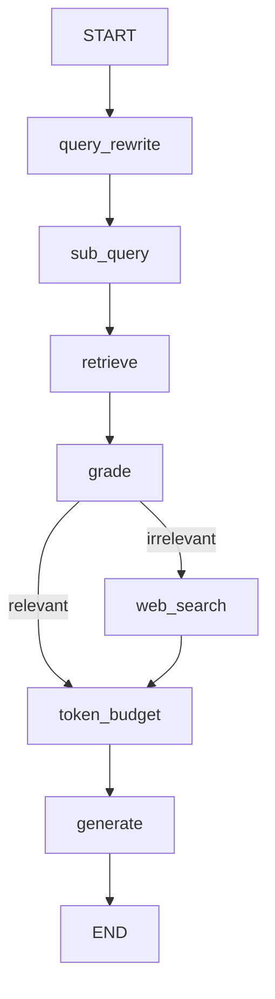

# Google NotebookLM Clone — Advanced RAG Pipeline

A full-stack AI application with an end-to-end RAG pipeline orchestrated by **LangGraph** and an **Agent SDK** abstraction layer. Upload PDFs, ask questions, and get answers grounded in your documents with advanced retrieval strategies.

## Live Demo & Links

- **GitHub Repository**: [Insert GitHub Link Here]
- **Live Project Link**: [Insert Live Demo Link Here]

## Curriculum Coverage

### RAG 2 — Advanced Retrieval Strategies

| Topic | Implementation |
|---|---|
| Bottlenecks in RAG | `src/utils/bottlenecks.ts` — per-stage latency tracking surfaced in API response |
| Speed vs accuracy tradeoff | `src/config.ts` — `fast` / `balanced` / `accurate` modes with different K, HyDE, reranking |
| Query rewriting (SLM) | `src/rag/query-rewrite.ts` + LCEL chain in `src/langchain/chains.ts` |
| LLM judges | `src/rag/judge.ts` + `grade` node in LangGraph |
| Sub-query enhancement | `src/rag/sub-query.ts` — decomposes complex questions into focused sub-queries |
| Corrective RAG | `web_search` node — Wikipedia fallback when LLM judge says context is irrelevant |
| HyDE | `src/rag/hyde.ts` — generates hypothetical document, embeds it for retrieval |
| Re-ranking (cross-encoders) | `src/rag/rerank.ts` — `cross-encoder/ms-marco-MiniLM-L-6-v2` with lexical fallback |
| Context window & token bottlenecks | `src/utils/token-budget.ts` — truncates context to `maxContextTokens` |
| Chunk size & overlap tradeoffs | `src/config.ts` `CHUNK_PRESETS` — 800/50 (fast), 600/100 (balanced), 400/150 (accurate) |

### LangChain Fundamentals & LangGraph

| Topic | Implementation |
|---|---|
| Why frameworks are required | See [Framework vs SDK](#framework-vs-sdk) below |
| PromptTemplates | `src/langchain/prompts.ts` |
| Runnables | `src/langchain/llm.ts` — custom `HuggingFaceChatModel` |
| Chains (LCEL) | `src/langchain/chains.ts` — `prompt \| model \| parser` pipes |
| Output Parsers | `src/langchain/parsers.ts` — `StringOutputParser` + Zod schemas |
| Tool calling | `src/langchain/tools.ts` — `wikipedia_search`, `document_retrieve` |
| LangGraph state machines | `src/graph/workflow.ts` |
| Nodes, edges, conditional branching | 7 nodes; conditional edge after `grade` node |
| Multi-step reasoning / tool orchestration | Full graph: rewrite → sub-query → retrieve → grade → [web] → budget → generate |
| Agent state persistence & checkpointing | `MemorySaver` checkpointer; `GET /api/thread/:threadId` |

### Agent SDK — Fundamentals

| Topic | Implementation |
|---|---|
| Flaws in LangGraph | Documented in `src/agents/sdk.ts` header comments |
| Agent SDK overview | `src/agents/sdk.ts` — `Agent.create()`, `AgentSDK` class |
| Agent lifecycle | `src/agents/lifecycle.ts` — idle → running → completed/failed |
| Tool calling patterns | Agents bind LangChain `DynamicStructuredTool` instances |
| Agent orchestration | `src/agents/orchestrator.ts` — wires 4 agents to LangGraph |
| Handoff / Agent as a Tool | `src/agents/handoff.ts` — `agent.handoff(target)` chain |
| SDK vs framework comparison | See [Framework vs SDK](#framework-vs-sdk) below |

## Framework vs SDK

**Why frameworks are required:** Raw API calls (embed → search → prompt) become unmanageable as you add query rewriting, grading, fallbacks, and reranking. Frameworks provide composable primitives (chains, graphs, tools) and state management.

**LangGraph (framework):** You define nodes, edges, state schema, and checkpointing. Full control, but verbose for simple flows.

**Agent SDK (this project):** A thin abstraction over LangGraph exposing `Agent.create()`, lifecycle tracking, and `handoff()`. Simpler API for multi-agent patterns.

**Known LangGraph flaws mitigated by the SDK:**
- Steep learning curve → SDK provides `create` / `run` / `handoff`
- Tool registration boilerplate → SDK auto-binds tools
- No built-in lifecycle → SDK tracks status transitions
- Manual handoff wiring → SDK exposes `handoff()` directly

## Pipeline Architecture



**Retrieval modes:**

| Mode | Query Rewrite | Sub-queries | HyDE | Reranking | Context Tokens |
|---|---|---|---|---|---|
| fast | ❌ | ❌ | ❌ | ❌ | 1,500 |
| balanced | ✅ | ✅ | ❌ | ✅ | 2,500 |
| accurate | ✅ | ✅ | ✅ | ✅ | 4,000 |

## Project Structure

```
src/
├── config.ts              # Speed/accuracy modes, chunk presets
├── ask.ts                 # Entry point via orchestrator
├── server.ts              # Express API
├── rag/
│   ├── ingest.ts          # PDF → chunks → Qdrant
│   ├── retrieval.ts       # HyDE + vector search
│   ├── query-rewrite.ts   # SLM query translation
│   ├── sub-query.ts       # Query decomposition
│   ├── hyde.ts            # Hypothetical Document Embeddings
│   ├── rerank.ts          # Cross-encoder reranking
│   └── judge.ts           # LLM relevance grader
├── langchain/
│   ├── prompts.ts         # PromptTemplates
│   ├── parsers.ts         # Output Parsers
│   ├── chains.ts          # LCEL chains
│   ├── tools.ts           # LangChain tools
│   └── llm.ts             # Custom ChatModel
├── graph/
│   ├── state.ts           # LangGraph state schema
│   ├── nodes.ts           # Graph node functions
│   └── workflow.ts        # Compiled graph + checkpointing
├── agents/
│   ├── sdk.ts             # Agent SDK core
│   ├── lifecycle.ts       # Lifecycle manager
│   ├── handoff.ts         # Handoff chain executor
│   └── orchestrator.ts    # SDK + LangGraph orchestration
└── utils/
    ├── bottlenecks.ts     # Latency profiler
    ├── token-budget.ts    # Context window management
    └── llm.ts             # HF Inference wrapper
```

## Tech Stack

- **Backend**: Node.js, Express, TypeScript
- **AI Frameworks**: LangChain (LCEL, PromptTemplates, Tools), LangGraph (state machines, checkpointing)
- **Agent Layer**: Custom Agent SDK (lifecycle, handoff, orchestration)
- **Embeddings**: `BAAI/bge-small-en-v1.5` via HuggingFace
- **LLM**: `meta-llama/Llama-3.1-8B-Instruct` via HuggingFace Inference
- **Reranker**: `cross-encoder/ms-marco-MiniLM-L-6-v2`
- **Vector DB**: Qdrant

## Local Setup

### Prerequisites

- Node.js v18+
- Qdrant (Docker or Cloud)
- HuggingFace API key

### Installation

```bash
git clone <your-repo-url>
cd notebooklm-rag
npm install
```

Create `.env`:

```env
QDRANT_URL=http://localhost:6333
QDRANT_API_KEY=your_qdrant_api_key_if_any
HUGGINGFACEHUB_API_KEY=your_hf_api_key
PORT=3000
```

Start Qdrant:

```bash
docker run -p 6333:6333 -p 6334:6334 qdrant/qdrant
```

Run:

```bash
npm run dev
```

Open `http://localhost:3000`.

## API Endpoints

| Method | Path | Description |
|---|---|---|
| GET | `/api/config` | Pipeline modes, chunk presets, stage list |
| POST | `/api/upload` | Upload PDF (`mode`: fast/balanced/accurate) |
| POST | `/api/ask` | Ask question (`mode`, optional `threadId`) |
| GET | `/api/thread/:threadId` | Resume checkpointed conversation state |

## Grading Checklist

- [x] GitHub Repository available
- [x] Live Project deployed
- [x] Full RAG pipeline (ingestion → chunking → embedding → retrieval → generation)
- [x] Advanced retrieval (query rewrite, HyDE, sub-queries, reranking, corrective RAG)
- [x] LangChain LCEL chains, PromptTemplates, Output Parsers, Tools
- [x] LangGraph workflow with nodes, edges, conditional branching, checkpointing
- [x] Agent SDK with lifecycle, handoff, orchestration
- [x] Speed vs accuracy modes with bottleneck metrics
- [x] Answer quality enforced (context-only responses)
- [x] Modular code with comprehensive documentation
